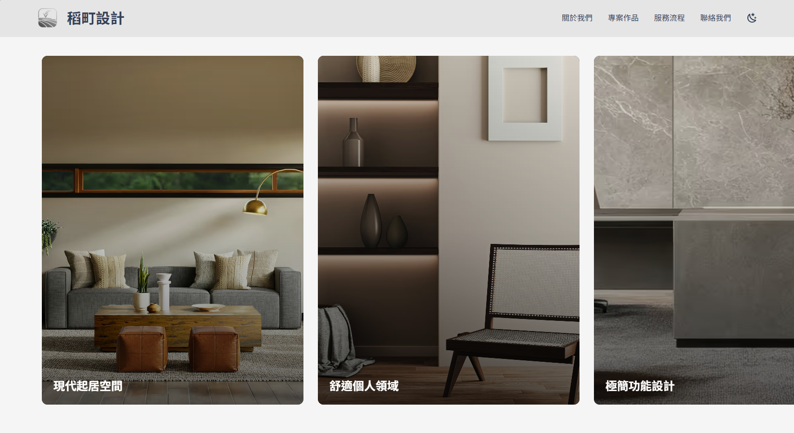
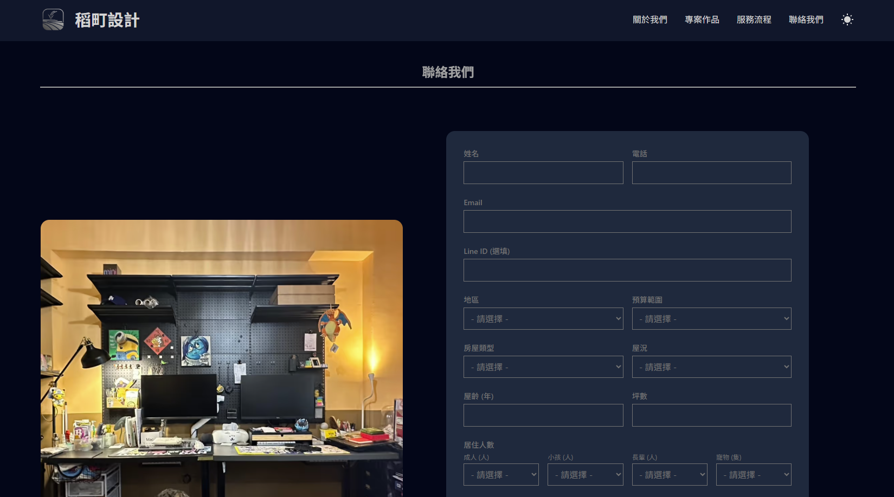
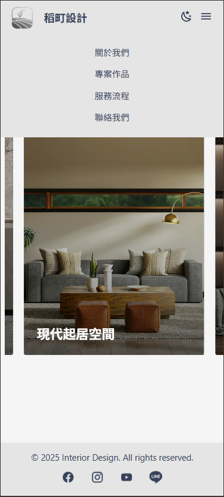
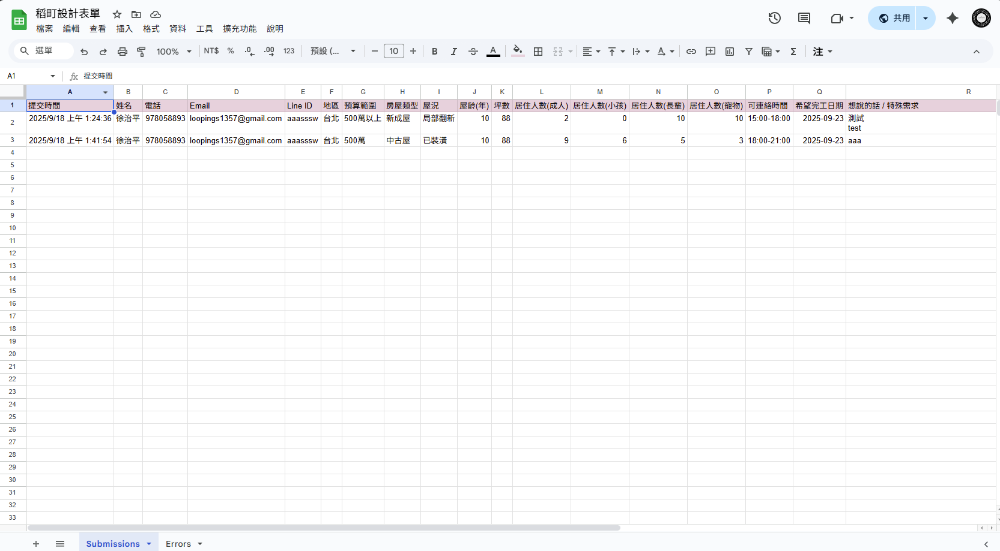

# Interior Design Portfolio Website

A modern, responsive portfolio website for an interior design studio, built with SvelteKit and Tailwind CSS.

**Live Demo: [https://din-interior-design.netlify.app](https://din-interior-design.netlify.app)**

## Preview

|                     Light Mode Swiper                      |                 Dark Mode                  |                       Mobile Menu                        |
| :--------------------------------------------------------: | :----------------------------------------: | :------------------------------------------------------: |
|  |  |  |

---

## About The Project

This project is a clean, image-focused portfolio website designed to showcase interior design projects. It features a minimalist aesthetic, smooth animations, and a user-friendly interface that works seamlessly across all devices.

---

## Key Features

- **🎨 Modern & Responsive Design:** A clean and fully responsive layout built with Tailwind CSS, ensuring a great experience on desktops, tablets, and mobile phones.
- **🌓 Light/Dark Mode:** A theme toggle allows users to switch between light and dark modes for optimal viewing comfort.
- **🚀 Dynamic Project Pages:** Project details are loaded dynamically using SvelteKit's file-based routing (`/projects/[slug]`).
- **✨ Smooth Animations:** Subtle scroll-triggered animations are implemented to enhance the user experience.
- **📬 Backend-less Contact Form:** Uses **Netlify Forms** for hassle-free form submissions, with data automatically sent to a **Google Sheet** for easy management.
- **📱 Mobile-First Navigation:** Includes a fully functional hamburger menu for smaller screens.

---

## Netlify Form to Google Sheets

This project uses a Google Apps Script to automatically send contact form submissions from Netlify to a Google Sheet.

### How It Works

1.  A user submits the contact form on the website, which is handled by Netlify Forms.
2.  Netlify is configured to trigger a `submission-created` event, which sends the form data to a specific URL.
3.  This URL points to a deployed Google Apps Script, which acts as a web application.
4.  The script parses the incoming data and appends it as a new row in the designated Google Sheet.

### Setup

1.  **Create a Google Sheet:**
    Create a new sheet in your Google Drive. Name the first tab "Submissions". You can also create a second tab named "Errors" to log any potential issues.

    

2.  **Create the Google Apps Script:**
    - In your Google Sheet, go to `Extensions` > `Apps Script`.
    - Copy the code below and paste it into the script editor.

    <details>
    <summary>Click to view Google Apps Script Code</summary>

    ```javascript
    function doPost(e) {
    	try {
    		var requestBody = e.postData.contents;
    		var data = JSON.parse(requestBody);
    		var formData = data.data;
    		var sheet = SpreadsheetApp.getActiveSpreadsheet().getSheetByName('Submissions');

    		// If the sheet is empty, create a header row
    		if (sheet.getLastRow() === 0) {
    			sheet.appendRow([
    				'提交時間',
    				'姓名',
    				'電話',
    				'Email',
    				'Line ID',
    				'地區',
    				'預算範圍',
    				'房屋類型',
    				'屋況',
    				'屋齡(年)',
    				'坪數',
    				'居住人數(成人)',
    				'居住人數(小孩)',
    				'居住人數(長輩)',
    				'居住人數(寵物)',
    				'可連絡時間',
    				'希望完工日期',
    				'想說的話 / 特殊需求'
    			]);
    		}

    		// Append the new form data
    		sheet.appendRow([
    			new Date(),
    			formData.name,
    			formData.phone,
    			formData.email,
    			formData['line-id'],
    			formData.area,
    			formData['budget-range'],
    			formData['house-type'],
    			formData['house-condition'],
    			formData['house-age'],
    			formData['square-footage'],
    			formData['residents-adults'],
    			formData['residents-children'],
    			formData['residents-elders'],
    			formData['residents-pets'],
    			formData['available-time'],
    			formData['completion-date'],
    			formData.message
    		]);

    		return ContentService.createHtmlOutput('Success');
    	} catch (error) {
    		var errorSheet =
    			SpreadsheetApp.getActiveSpreadsheet().getSheetByName('Errors') ||
    			SpreadsheetApp.getActiveSpreadsheet().insertSheet('Errors');
    		errorSheet.appendRow([new Date(), error.toString(), e.postData.contents]);
    		return ContentService.createHtmlOutput('Error: ' + error.toString()).setMimeType(
    			ContentService.MimeType.TEXT
    		);
    	}
    }
    ```

    </details>

3.  **Deploy the Script:**
    - Click the **Deploy** button in the Apps Script editor and select **New deployment**.
    - For "Select type," choose **Web app**.
    - In the settings:
      - **Description:** A brief description (e.g., "Netlify Form Handler").
      - **Execute as:** `Me`.
      - **Who has access:** `Anyone`.
    - Click **Deploy**.
    - **Important:** Copy the generated **Web app URL**. You will need it for Netlify.

4.  **Configure Netlify:**
    - Go to your site's dashboard on Netlify.
    - Navigate to `Project Overview` > `Forms`.
    - Activate the `Form Detection`.
    - Navigate to `Project Cofiguration` > `Emails and Webhooks`.
    - In the `Form submission notifications` section, add a new notification and choose **"HTTP Post Request"**.
    - **Event to listen for:** `New Form Submission`.
    - **URL to notify:** Paste the Web app URL you copied from Google Apps Script.
    - If you are using ISR/SSG/SSR method:
      - You should build a plain static dummy form html file (need to be the same elements with the original form), or the Netlify Form detection may fail.
      - You should set your form (the original one) action pointing to a static file (doesn't matter what file it is).
      - If you want to make a custom `Thank-You-Page`, in this circumstance, you should make it static html file and set the form action pointing to this custom file.

---

## Tech Stack

- **Framework:** [SvelteKit](https://kit.svelte.dev/)
- **Language:** [TypeScript](https://www.typescriptlang.org/)
- **Styling:** [Tailwind CSS](https://tailwindcss.com/)
- **Deployment:** [Netlify](https://www.netlify.com/)
- **Linting & Formatting:** [ESLint](https://eslint.org/) & [Prettier](https://prettier.io/)

---

## Getting Started

To get a local copy up and running, follow these simple steps.

### Prerequisites

- Node.js (v18.x or later)
- npm

### Installation & Development

1. Clone the repo
   ```sh
   git clone https://github.com/your_username/your_repository.git
   ```
2. Install NPM packages
   ```sh
   npm install
   ```
3. Start the development server
   ```sh
   npm run dev
   ```

---
